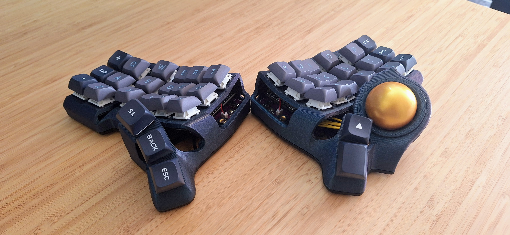
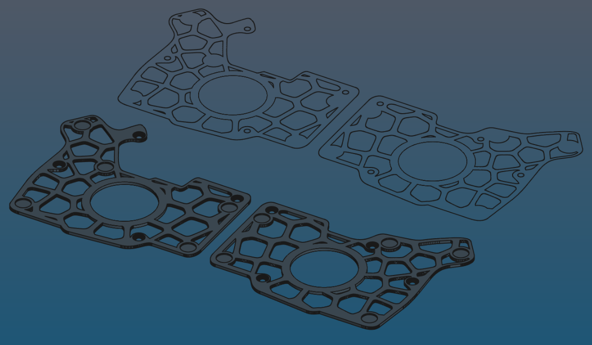
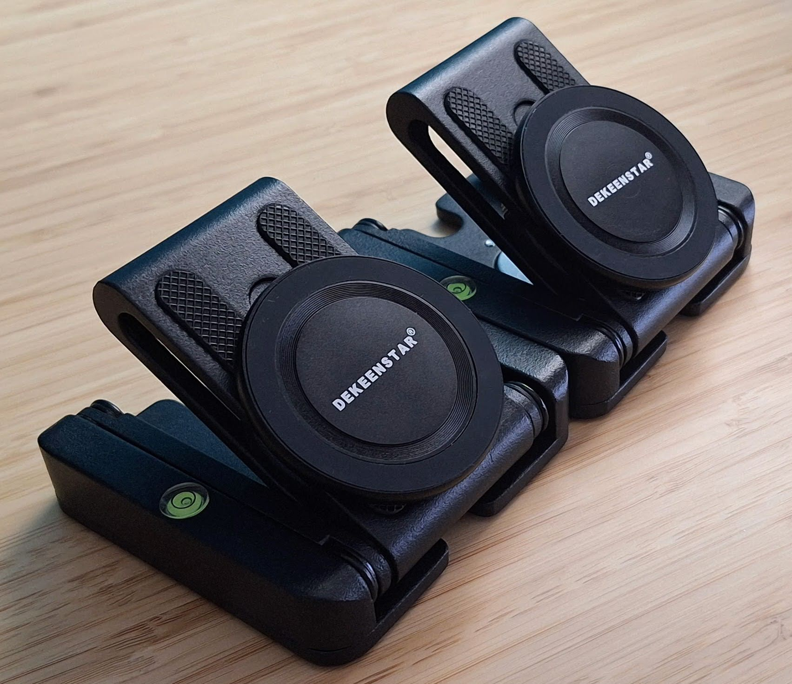
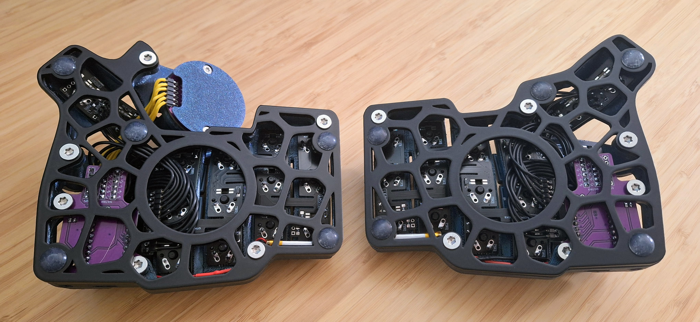
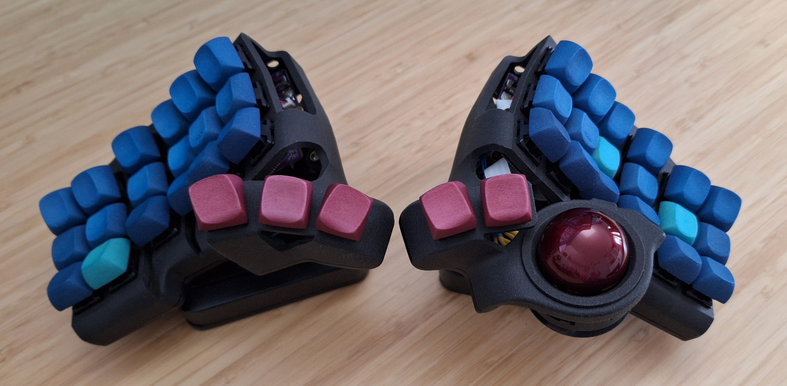

# Wireless Charybdis Mini (3x6) Build Guide

### HOME BUILD

### WORK BUILD

# Intro

This repository is a comprehensive build guide for the Charybdis keyboard, which is an open source, ergonomic keyboard created by [Bastard Keyboards](https://github.com/Bastardkb/Charybdis) and graciously shared with the community.

This guide is a log of all the steps I took in my build process, and for the most part is just a long winded version of Eren Atas' [supremely helpful build guide](https://github.com/erenatas/charybdis-wireless-3x6/blob/master/README.md). However it additionally includes instructions and links to firmware for both wireless bluetooth and wireless dongle configurations.

**Join the Community**

For any questions, clarifications, or simply to connect with fellow Charybdis builders, feel free to join the Bastard Keyboards [Discord community](http://www.bstkbd.com/discord).

**Disclaimer**

This guide serves as a resource to assist you in building your Charybdis. I assume no responsibility for any damages or malfunctions that may occur during the build process.

# Build Guide

## Bill of Materials

These are all the components that need to be ordered to build the keyboard. The quantity column denotes how many of each component are required for the build. Adjust your order quantity as needed.

### PCBs

| **Part**                                                                                                 | **Quantity** |
| -------------------------------------------------------------------------------------------------------- | ------------ |
| [PMW3610 Breakout](https://github.com/victorlucachi/charybdis-pmw3610-breakout/tree/nicenano/production) | 1            |
| [Nano Holder](https://github.com/olidacombe/Elite-C-holder/tree/nicenano/adapter/production)             | 2            |
| [Thumb Right (0.8 thickness)](https://github.com/Bastardkb/Charybdis-PCB-thumbs/releases/tag/2.01)       | 1            |
| [Thumb Left (0.8 thickness)](https://github.com/Bastardkb/TBK-Mini-PCB-thumb-cluster/releases/tag/2.1)   | 1            |
| [Plate (0.8 thickness)](https://github.com/Bastardkb/TBK-Mini-PCB-plate/releases/tag/2.21)               | 2            |

I ordered the PCBs from [JLCPCB](https://jlcpcb.com/).

> [!WARNING]
> **A thickness of 0.8 or less** must be set for the left thumb, right thumb, and plate PCBs.

The gerber files have all been pulled from other repositories and are stored in the PCB Gerber Files directory. However, each source repository is linked in the part list above for reference.

> [!NOTE]
> An alternative to victorlucachi's PMW3610 breakout design linked above is the [sensor board designed by Bastard Keyboards](https://github.com/Bastardkb/charybdis-pmw3610-breakout).

### 3D Case Prints

| **Part**                                                                                                                              | **Quantity** |
| ------------------------------------------------------------------------------------------------------------------------------------- | ------------ |
| [Right Plate](https://github.com/Bastardkb/Charybdis/blob/3908164/files/3x6%20mini/plate_v1_v11.stl)                                  | 1            |
| [Left Plate](https://github.com/erenatas/charybdis-wireless-3x6/blob/master/3d-prints/plate_v3_v29_mirrorred.stl)                     | 1            |
| [Right Case](https://github.com/Bastardkb/Charybdis/blob/2dad0ca/files/3x6%20mini/CMini_v1_v11.3mf)                                   | 1            |
| [Left Case](https://github.com/erenatas/charybdis-wireless-3x6/blob/master/3d-prints/case_v3_v29_mirrorred.stl)                       | 1            |
| [Sensor Cover](https://github.com/Bastardkb/Charybdis/blob/9130a58/files/sensor_cover_v51.stl)                                        | 1            |
| [Adapter Top](https://github.com/Bastardkb/Charybdis/blob/c818c76/files/3x5%20nano/adapter_v2_top_v75.stl)                            | 1            |
| [Adapter BTU Bottom](https://github.com/Bastardkb/Charybdis/blob/d0e20cc/files/mods/btu/adapter_btu_bottom_v32.stl)                   | 1            |
| [Ball Transfer Unit (BTU)](https://github.com/Bastardkb/Charybdis/blob/322faad/files/mods/printable-btu/printable_btu_2.5mm_ball.stl) | 3            |

The files for these are in the 3D Print STL Files directory, and the source repos have been linked in the parts list above.

I printed these parts at home in PETG and they turned out great. I also had a set printed by JLC3DP in Nylon. That order came with a warning that some of the parts may be too thin, but I accepted the risk and they arrived just fine.

Instead of printing static tents, I used some camera & phone equipment (see tenting section below). If you choose this method as well, you don't need to print the bottom plates since they'll need to be cut out of metal separately.

### 3D Key Cap Prints

| **Part** | **Quantity** |
| -------- | ------------ |
| r1       | 2            |
| r2       | 2            |
| r3       | 2            |
| thumb    | 1            |

For one of the builds I used custom printed DES profiled key caps. These were designed by [pseudoku](https://github.com/pseudoku/PseudoMakeMeKeyCapProfiles) The key set files in this repo will print sets of 10 keys for row one, two, and three, and a single set of ergo thumb keys. Row two will have home dots for the keys that go under each index finger.

JLC3DP SLS printed these in white Nylon. I dyed some of them, and I used the spares to create molds so I could create more in custom resin colors.

> [!NOTE]  
> JLC3DP charges per-part, and only allows combining a maximum of 10 small parts into a single print, which is why the sprues are included in the STL files. This means that each order is 10 keys for rows 1-3 and six keys for the thumbs.

If you have different printing requirements/capabilities, the OpenSCAD code in [this fork](https://github.com/280Zo/PseudoMakeMeKeyCapProfiles) can be changed by updating the keeb.scad file to render whatever keys you like, with or without sprues, and with or without home dots. If more than one set of rows is rendered at a time, and sprues are enabled, the sprues will be meshed in a grid.

### PMW3610 Sensor

| **Part**                                                                                    | JLCPCB Part #                                                                | MFR. Part #       | **Quantity** |
| ------------------------------------------------------------------------------------------- | ---------------------------------------------------------------------------- | ----------------- | ------------ |
| [PMW3610 module with lens (LM18-LSI)](https://www.aliexpress.us/item/3256806022278018.html) | N/A                                                                          | N/A               | 1            |
| [LDO](https://www.mouser.com/ProductDetail/595-TLV70018DDCR)                                | [C79924](https://jlcpcb.com/partdetail/TexasInstruments-TLV70018DDCR/C79924) | TLV70018DDCR      | 1            |
| [Thick Film Resistor](https://www.mouser.com/ProductDetail/303-0603WAF2004T5E)              | [C22976](https://jlcpcb.com/partdetail/23703-0603WAF2004T5E/C22976)          | 0603WAF2004T5E    | 1            |
| [Ceramic Capacitors](https://www.mouser.com/ProductDetail/187-CL10A105KB8NNNC)              | [C15849](https://jlcpcb.com/partdetail/16531-CL10A105KB8NNNC/C15849)         | CL10A105KB8NNNC   | 1            |
| [Ceramic Capacitors](https://www.mouser.com/ProductDetail/603-CC603KRX7R9BB104)             | [C14663](https://jlcpcb.com/partdetail/Yageo-CC0603KRX7R9BB104/C14663)       | CC0603KRX7R9BB104 | 1            |
| [Ceramic Capacitors](https://www.mouser.com/ProductDetail/187-CL10A475KO8NNNC)              | [C19666](https://jlcpcb.com/parts/componentSearch?searchTxt=C19666)          | CL10A475KO8NNNC   | 7            |

These are all the components required for the sensor breakout PCB. It's possible to have JLCPCB assemble the PCB and components for you. Just select that option at checkout and supply the bom.csv and positions.csv from the PMW3610 Breakout zip.

I chose to solder the parts on myself so I ordered the parts above. A diagram of where to solder each component on is in the assembly instructions.

> [!NOTE]
> Part number [C79924](https://jlcpcb.com/partdetail/TexasInstruments-TLV70018DDCR/C79924)/TLV70018DDCR is a substitute for [C146366](https://jlcpcb.com/jp/partdetail/TOSHIBA-TCR2EF19_LMCT/C146366)/TCR2EF19,LM(CT) which is what the designer of the PCB originally used. Either component will work, but if you plan to have JLCPCB assemble the sensor board the C146366 is what's included in the parts list and it is often out of stock. The replacement is normally available which is why it's used above.

### General Components

| **Part**                                                                                                                                                               | **Quantity**                            |
| ---------------------------------------------------------------------------------------------------------------------------------------------------------------------- | --------------------------------------- |
| [Trackball](https://www.amazon.com/Perixx-18021-PERIPRO-303GR-Trackball-Compatible/dp/B071NX7Y2J)                                                                      | 1                                       |
| [SuperMini NRF52840 Microcontrollers](https://www.aliexpress.us/                                  |
| [Mill Max Low Profile Sockets 315-43-112-41-003000 (optional)](https://www.mouser.com/ProductDetail/Mill-Max/315-43-112-41-003000?qs=s8Nb1z4Wn%2FRfWrVqQ0TOuQ%3D%3D)   | 4                                       |
| [Mill Max Pins 3320-0-00-15-00-00-03-0 (optional)](https://www.mouser.com/ProductDetail/Mill-Max/3320-0-00-15-00-00-03-0?qs=s8Nb1z4Wn%2FQ16WBIwCPrTw%3D%3D)            | 48                                      |
| [1N4148W Signal Diodes](https://www.amazon.com/gp/product/B079KJX5J9/ref=ox_sc_act_title_1?smid=A14FP9XIRL6C1F&psc=1)                                                  | 41                                      |
| [Button (4x4x1.5)](https://www.aliexpress.us/item/2255800859820067.html?gatewayAdapt=glo2usa4itemAdapt)                                                                | 2                                       |
| [Mini Toggle Switch SPDT 3mm](https://www.amazon.com/Position-Breadboard-Electronic-Miniature-SlideSwitch/dp/B09R42XQTB)                                               | 2                                       |
                                |
| [2.5mm Silicon Nitride Ceramic Ball Bearings](https://www.aliexpress.us/item/2255799954006155.html)                                                                    | 3                                       |
| [80MM Flexible Flat Cables (Flexstrip Jumper)](https://www.aliexpress.us/item/3256803312420217.html)                                                                   | 2 - 6 pin   2 - 5 pin   2 - 4 pin |
| [100MM Flexible Flat Cables (Flexstrip Jumper)](https://www.mouser.com/ProductDetail/TE-Connectivity/FSN-24A-15?qs=sGAEpiMZZMv0DJfhVcWlK2hMVXoZwMunw%2Fzfkr%2F5Lgc%3D) | 2                                       |
| [Gateron oil king 2.0 switch three-layer pin self-lubricating linear handle 55gf Key Switches](https://www.aliexpress.us/item/3256806388542736.html)                   | 41                                      |
| [M3 x D5 x L5 Brass Melt Nuts](https://www.aliexpress.us/item/3256805371193370.html)                                                                                   | 5                                       |
| [M4 x D6 x L5 Brass Melt Nuts](https://www.aliexpress.us/item/2255800046610840.html)                                                                                   | 12                                      |
| [M3 8mm Torx Screws](https://www.aliexpress.us/item/2251832820627860.html)                                                                                             | 5                                       |
| [M4 8mm Torx Screws](https://www.aliexpress.com/item/2251832820627860.html)                                                                                            | 12                                      |
                                 |
| [Adhesive bumper pads](https://www.amazon.com/Shintop-Furniture-Bumpers-Protection-Hemispherical/dp/B01DU0O00W)                                                        | 10                                      |

> [!NOTE]  
> To build the keyboard in the dongle configuration doesn't require any additional build steps, but it does require the purchace of an additional MCU and use of the correct firmware (see the Firmware section below).

The standard for microcontrollers on the Charybdis wireless keyboard builds is the nice!nano v2.0. However, there are some cheaper alternatives documented on [this MCU wiki](https://github.com/joric/nrfmicro/wiki/Alternatives). This build uses the SuperMini NRF52840.

If you'd prefer a quieter set of key switches, there are lots of alternaves. I used the [Akko V3 Penguin Tactile Silent Keyboard Switches](https://www.amazon.com/Akko-Keyboard-Mechanical-Switches-Structure/dp/B0CJY7QN11/ref=sr_1_1) for my work keyboard and they are decent enough.

The battery needs to be 3.7v and more than 80mAh. You can use the [ZMK Power Profiler](https://zmk.dev/power-profiler) to estimate the mAh you need for your application. Make sure the dimesions match your chosen mounting location.

The cable length requirements for the flex strip cables varies between components

|     Component    	| Length 	|
|:----------------:	|:------:	|
| Nice!Nano Holder 	|   75mm 	|
| Thumb Plates     	|   80mm 	|
| PMW3610 Sensor   	|  100mm 	|

The cables can be a bit longer or shorter, but sticking close to these lengths will make installation much easier. The parts list above uses 89mm for both the thumb plates and Nice!Nano holders, and 100mm for the sensor.

## Tool List

- Soldering iron with a fine tip and adjustable temperatures
- Solder
- Solder wick and desoldering pump
- ESD safe tweezers
- Kapton tape
- Double sided tape
- Torx screw drivers (T10 and T20)
- Scissors
- Flush cutting pliers
- (optional) ESD mat and strap
- (optional) filter fan
- (optional) flux
- (optional) heat shrink tubing for battery connection
- (optional) self closing tweezers or kelly forceps
- (optional) magnifying glass or microscope

## Assembly

Bastard Keyboard's build guides are excellent and comprehensive. Their documentation will be linked as much as possible in the steps below.

**Melt nuts**

Follow BastardKB's [build guide to install screw inserts on the cases](https://docs.bastardkb.com/bg_charybdis/04screw_inserts.html).

Then follow their [build guide to install screw inserts on the sensor assembly](https://docs.bastardkb.com/bg_charybdis/11sensor_assembly.html#preparing-the-3d-holder-assembly).

**Diodes**

BastardKB's documentation on how to [solder diodes on both plates and thumb clusters](https://docs.bastardkb.com/bg_charybdis/05diodes.html).

**Sensor Breakout Components (optional)**

If you've chosen to solder the components on the PMW3610 breakout PCB, follow the diagram below to get them in the correct spots.

A stand with a magnifying glass, or a digital microscope are very helpful when trying to ensure the soldering is done correctly on these small components.

**PMW3610**

The lens of the sensor should be removed or covered with Kapton tape while soldering. Orient the sensor so that the back of it is on the same side as the other components, then solder it in place.

When working with the sensor and the MCU it's best to keep soldering iron temperatures below 300°C.

> [!WARNING]
> As mentioned above, do not set your soldering iron any higher than 300°C.

Being careful to not short any connections, connect the JST battery connections, turn the switch to the on position, and confirm the MCU powers on.

If all goes well, unplug the battery and continue the assembly.

**Cables**

If you want the cables a different color, make sure to paint them before this step. Use some tape to cover the pins so they can still be soldered.

Use [BastardKB's documentation](https://docs.bastardkb.com/bg_charybdis/07ribbon_cables.html#cutting-the-cables) on how to cut and solder the ribbon cables.

Then follow the [BastardKB docs](https://docs.bastardkb.com/bg_charybdis/09cables_to_splinky.html) on how to connect all of the PCBs together.

Make sure to use the flush cut pliers to remove any protruding pins and solder from the back side of the PCBs so that they can sit flat against the cases when the switches are being soldered in.

**Testing**

Now that everything is connected follow [BastardKB's documentation](https://docs.bastardkb.com/bg_charybdis/10install_the_switches.html#testing-the-pcbs) to test the switch pads and internal connections.

**Switches**

Once all the switch pads have been confirmed to work, solder in the switches by following [BastardKBs documentation](https://docs.bastardkb.com/bg_charybdis/10install_the_switches.html#installing-the-switches).

**Sensor PCB**

Put the sensor cover into the right case, install the BTUs into the Adapter BTU Bottom, then screw the Adapter BTU Bottom into the sensor cover.

Make sure to push the BTUs all the way into the Adapter BTU Bottom. It should look something like this.

Finally, install the sensor PCB and sensor cover by screwing them into the BTU bottom adapter.

**Pads**

Install the anti-slip pads on to the bottom of each plate.

**Final Test**

Install the key caps, then connect each half to the computer the same way you did for the previous test. Confirm that each key still works.

# Tenting

A tenting solution that's stable, adjustable, and re-usable across multiple keyboards requires a few additional components:

### Parts List

| Part                                                              | Quantity |
| ----------------------------------------------------------------- | -------- |
| [Quick Release Plate](https://www.amazon.com/dp/B08NGC3M9M)       | 2        |
| [55mm Magnetic Phone Mount](https://www.amazon.com/dp/B0D21RP69C) | 2        |
| Ferromagnetic Right Plate                                         | 1        |
| Ferromagnetic Left Plate                                          | 1        |

To 3D print the bottom plates use the STL files in `/Magnet Plates/3D STL/`.

To have the plates laser/water jet cut, use the dxf files in `/Magnet Plates/2D DXF/`. You'll need to have the screw holes chamfered as well. Depending on what type of steel is used, you may want to have them powder coated to prevent rusting.

To make changes to any of the files (e.g. to accommodate different size magnets), the SVG files have been included in the same directory.  

# ZMK Firmware

The firmware can be downloaded from the [charybdis-wireless-mini-zmk-firmware](https://github.com/280Zo/charybdis-wireless-mini-zmk-firmware) repo by opening the [Actions Workflows](https://github.com/280Zo/charybdis-wireless-mini-zmk-firmware/actions?query=is%3Acompleted+branch%3Amain) and downloading the latest successful build. Follow the instructions on the repo readme for more details, including how to flash the firmware, how to make changes to the key layouts, and how to customize and build your own firmware.

# Credits
This was my first keyboard build, and I couldn't have done it without the hard work from many others:
- [BastardKB](http://bastardkb.com/)
- [erenatas](https://github.com/erenatas/charybdis-wireless-3x6/blob/master/README.md)
- [pseudoku](https://github.com/pseudoku/PseudoMakeMeKeyCapProfiles)
- [toniz4](https://github.com/toniz4/PseudoMakeMeKeyCapProfiles)
- [inorichi](https://github.com/inorichi)
- [petejohanson](https://github.com/petejohanson)
- [VOID](https://github.com/victorlucachi)
- [olidacombe](https://github.com/olidacombe)
- [EIGA](https://www.youtube.com/watch?v=Mks7QDxFreY)
